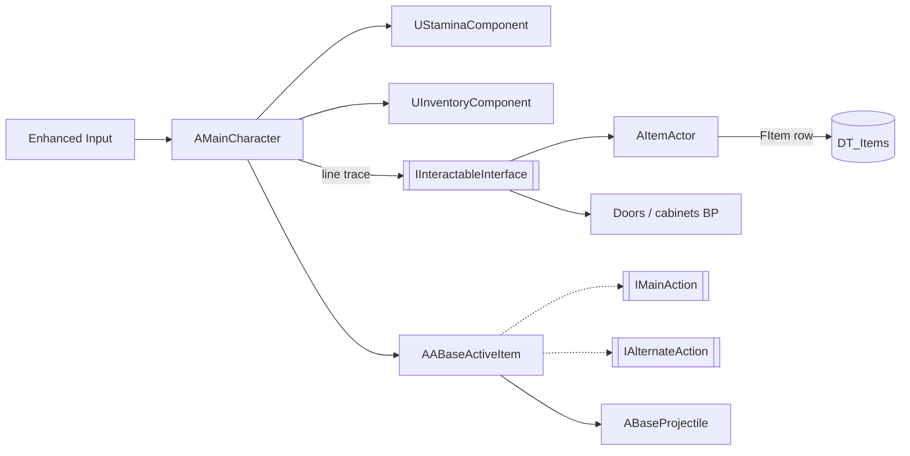

# Hellocracy

**A short story-driven first-person survival shooter set in a bureaucratic hell. Built with Unreal Engine 5.7 (C++ and Blueprints).**

▶ [Watch the trailer and play for free on Steam](https://store.steampowered.com/app/4777090/Hellocracy/)

## About

After death, the hero ends up in an endless office where demons wear ties. Fight your way through the corridors
with guns, melee weapons and grenades, collect supplies and find a way out.

- Released on Steam on June 18, 2026 (free to play, ~15 minutes of gameplay, Russian language).
- Team project made at **Lesta Games Academy**: 4 programmers, 2 game designers, 3 3D artists and 2 2D artists.

## My role

I was a gameplay programmer on the team. When the other three programmers left the project in December 2025,
I became **the only programmer**, took over their systems and shipped the game six months later.

Systems I implemented:

| System | Implementation | Code |
|---|---|---|
| Player character: movement, sprint, jump, dynamic FOV | C++, Enhanced Input | [`MainCharacter`](Source/OneFPSBastards/Player/MainCharacter.cpp) |
| Stamina with regeneration delay and HUD bar | C++ component | [`StaminaComponent`](Source/OneFPSBastards/Player/StaminaComponent.cpp) |
| Inventory with stacking | C++ component, DataTable | [`InventoryComponent`](Source/OneFPSBastards/Player/InventoryComponent.cpp) |
| Interaction: focus highlight, pickups, doors, cabinets | C++ interface + Blueprints | [`InteractableInterface`](Source/OneFPSBastards/Player/InteractableInterface.h), [`ItemActor`](Source/OneFPSBastards/Item/ItemActor.cpp) |
| Surface-dependent footsteps | C++, Physical Materials, DataAsset | [`SurfaceAudioData`](Source/OneFPSBastards/Player/SurfaceAudioData.cpp) |
| Combat: firearm, melee, grenades with ballistic trajectory | C++ interfaces + Blueprints | [`ABaseActiveItem`](Source/OneFPSBastards/Item/ABaseActiveItem.h), [`BaseProjectile`](Source/OneFPSBastards/Core/BattleSystem/Projectiles/BaseProjectile.cpp) |
| Enemy AI: shared behavior tree with patrol / chase / attack states, separate boss behavior | Behavior Tree, Blackboard, AIController | `Content/Afterlife/Core/BattleSystem/Enemies` |

## Architecture

Key decisions:

- **Components over inheritance** — stamina and inventory are reusable `UActorComponent`s, not part of the character class.
- **Interfaces for interaction and item actions** — the character doesn't know concrete item or weapon types.
- **Data-driven items** — item properties live in a DataTable, so designers can add items without code changes.

## What I would improve

- Use `TObjectPtr` / `TWeakObjectPtr` instead of raw UObject pointers.
- Update the HUD through delegates instead of polling every tick.
- Cover inventory logic with automation tests.

## Tech stack

Unreal Engine 5.7 · C++ · Blueprints · Behavior Trees · Enhanced Input · Diversion (main VCS during development) · Git

## Opening the project

1. Install Unreal Engine 5.7.
2. Clone the repository (large: assets are stored in plain Git, without LFS).
3. Right-click `OneFPSBastards.uproject` → *Generate Visual Studio project files*, then open the `.uproject`.
